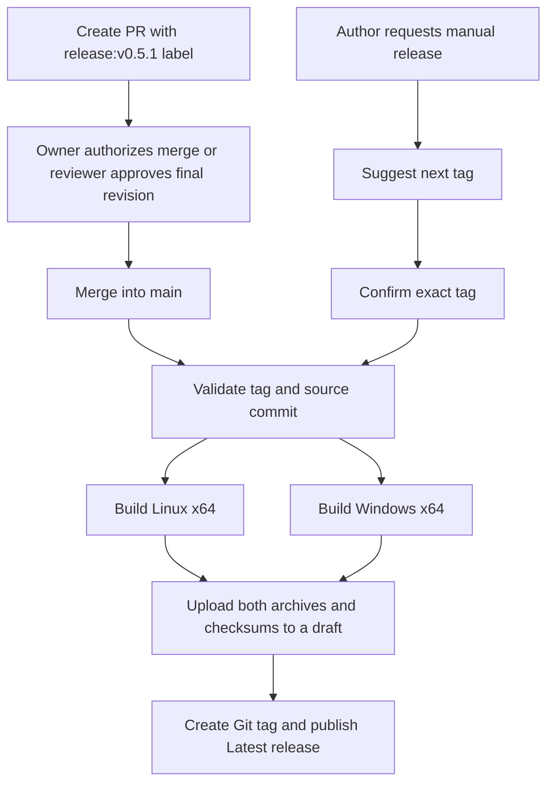

# Versioned releases

Releases contain Linux x64 and Windows x64 builds, the illustrated user guide,
and checksums. Each version uses an exact Git tag such as `v0.5.1` and appears on
the repository's [Releases page](https://github.com/tien226anh/wireless-voice-class/releases)
as the latest release.



Opening or updating a PR starts **no builds**. The automatic path requires a
version label and either a merge by the personal repository owner or approval
of the final revision before another maintainer merges. The manual path lets the repository
owner or another maintainer publish from `main` without a PR approval.

## Create a PR with a suggested exact version

Install Node.js 24 and GitHub CLI, authenticate with `gh auth login`, and commit
your changes on a feature branch. Write a PR description to a file, then run:

```bash
node scripts/release.mjs pr --title "Describe your change" --body-file /tmp/pr.md
```

The helper reads existing Git tags and releases (including drafts), suggests a
version, and lets you accept or change it. It pushes the feature branch, creates
the version label if needed, and opens a PR against `main` with that label. For
example, choosing `v0.5.1` adds **`release:v0.5.1`**. This is a PR label; the actual
Git tag is created only after both builds and asset uploads succeed.

To provide the version without an interactive prompt:

```bash
node scripts/release.mjs pr --title "Describe your change" --body-file /tmp/pr.md --version v0.5.1
```

You can also create the PR in GitHub's UI. Create a repository label named
`release:v0.5.1` and assign it to the PR before merging. Use exactly one
`release:` label. Values such as `release:patch` are not accepted.

1. As repository owner, review the change and merge it yourself. For another
   maintainer to merge, have a reviewer approve the final code revision.
2. Merge the PR into `main`.
3. Open **Actions → Versioned release** to follow both builds.
4. When publication finishes, open **Releases → v0.5.1**.

GitHub does not allow the PR author to approve their own PR. Your merge as the
personal repository owner counts as release authorization, so working alone
does not require a separate approval or a manual release. The workflow checks
the recorded merger's user ID; rerunning someone else's unapproved merge as the
owner does not approve it.

## Main branch protection

Two active repository rulesets protect `main`:

- **Main: pull requests and history protection** requires a PR and resolution of
  review discussions, and blocks force pushes and branch deletion. No bypass.
- **Main: reviewed changes with owner merge approval** requires one current
  approval and approval of the latest push. Only `tien226anh` can bypass this
  review requirement, and only when merging a PR. Use GitHub's bypass option
  when merging your own PR; the first ruleset still applies.

The configuration is tracked in `.github/rulesets/`. Editing those JSON files
does not automatically change GitHub settings. No pre-merge build check is
required because builds run only after merge. Release tags are outside these
branch rules, so the workflow can create them after successful builds.

## Manual release with a version suggestion

From your checkout, run:

```bash
node scripts/release.mjs manual
```

The helper prints the suggested tag, lets you choose a different one, then asks
you to confirm building `main` and publishing that version. Declining confirmation
starts nothing. Your checkout does not need to be on `main`; the workflow always
builds the `main` commit selected when the request is dispatched.

For an explicitly chosen version in a noninteractive command:

```bash
node scripts/release.mjs manual --version v0.5.1 --yes
```

`--yes` confirms publication. This is a real release, not a build-only check.
Manual releases require repository write, maintain, or admin access.

### Using GitHub's Actions page

GitHub's manual form cannot calculate a dynamic default tag. Use these two runs:

1. Select **Actions → Versioned release → Run workflow**, branch **main**.
2. Set **operation = suggest** and optionally choose **bump = patch/minor/major**.
3. Open the completed run's **Summary → Release plan** to see the suggested tag.
   This run checks the version only; it starts no builds and publishes nothing.
4. Select **Run workflow** again, set **operation = release**, and enter that exact
   tag in **version**. This starts both builds and publishes the release.

The CLI provides the same suggestion without an Actions run:

```bash
node scripts/release.mjs suggest
node scripts/release.mjs suggest --bump minor
```

The first suggestion uses `Cargo.toml`'s version (`v0.5.0` initially). Subsequent
suggestions increment the highest stable version numerically; a higher manifest
version takes precedence. Existing draft versions are reserved. Old tags such as
`v0.5.0-pr.1` do not determine the next stable version. A suggestion is not a
reservation: if another release uses it first, choose a newer tag.

## What gets published

For `v0.5.1`, the release assets are:

- `wireless-pa-v0.5.1-linux-x64.tar.gz`
- `wireless-pa-v0.5.1-windows-x64.zip`
- `SHA256SUMS`

Each archive contains its executable, `LICENSE`, `README.md`, `docs/`, `assets/`, and
`VERSION.txt` with the tag and exact source commit. The workflow stamps the chosen
version into the build checkout's root Cargo package and lockfile before running
`cargo build --locked --release`. It does not commit version changes to `main`.
The Git tag points to the original source commit recorded in `VERSION.txt`.

Windows executables embed the application logo as their icon. The Linux archive
also contains `wireless-pa.desktop`; see the [logo and launcher guide](BRANDING.md)
for application-menu installation and icon regeneration.

Both platform builds must succeed before publication. The workflow uploads to a
draft, checks that all three assets finished uploading, creates the tag at the
built commit, then publishes and marks the release **Latest**. A newer manual
release can build the same `main` commit under a new version.

## Failure and retry behavior

| Situation | Result / recovery |
| --- | --- |
| Direct push or untagged merge | No build or release. Main protection blocks direct pushes. Use a version-labeled PR. |
| Tagged merge by someone other than the owner without final-revision approval | Validation fails with an explicit error. Use the authorized manual flow to recover. |
| Manual operation is `suggest` | Build and publish are intentionally skipped. Run again with `operation=release` and the exact suggested version. |
| Tag is malformed, already used, or older than an existing stable version | Fails before building. Choose a new `vMAJOR.MINOR.PATCH` tag. |
| One build fails | No release is published. Fix the build, or rerun failed jobs for a transient failure. |
| Upload fails | The draft remains. Rerun the original workflow to retry the same version and commit. |
| Release already completed for this exact commit | Rerunning skips it; published assets are not replaced. |
| Tag/draft belongs to another commit or another release process | Fails without overwriting it. Choose a different version. |
| `main` advanced since a failed release | Rerun the original run to preserve its source SHA, or start a new manual release with a new version. |

Release requests are serialized to prevent competing publications. No personal
access token is needed in Actions: it uses the repository's built-in token.
The planning job only reads release information; only the publishing job creates
tags and releases. Build jobs have read-only repository access.

## Maintainer validation

```bash
node scripts/release.test.mjs
actionlint -ignore 'unexpected key "queue" for "concurrency" section' .github/workflows/release.yml
```

The narrow lint exception is for `queue: max`, which GitHub supports but
actionlint 1.7.12 does not yet recognize. Tests cover version selection, reviews,
manual authorization, version stamping, draft recovery, asset completion, and tag
collisions without publishing a release.

Older workflow runs retain the workflow and source from their original commit.
Rerunning a skipped run from before the owner-merge fix does not load the fix.
Merge the updated PR for automatic release, or use the manual release operation
on current `main`.

References: [manual workflow inputs](https://docs.github.com/en/actions/how-tos/manage-workflow-runs/manually-run-a-workflow),
[review rules](https://docs.github.com/en/pull-requests/how-tos/review-pull-requests/reviewing-proposed-changes-in-a-pull-request),
[repository rulesets](https://docs.github.com/en/rest/repos/rules#create-a-repository-ruleset),
and [queued release runs](https://docs.github.com/en/actions/how-tos/write-workflows/choose-when-workflows-run/control-workflow-concurrency).
