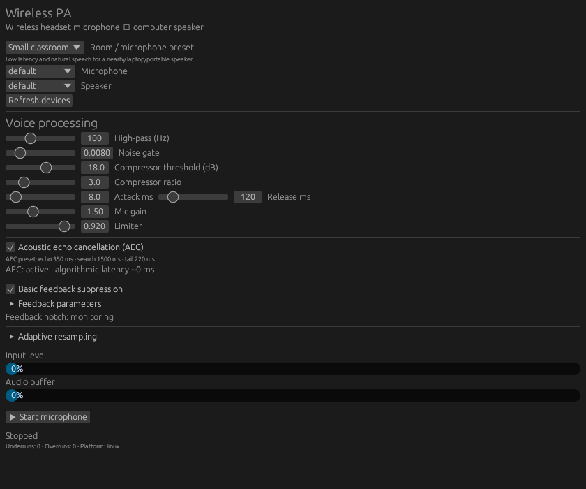
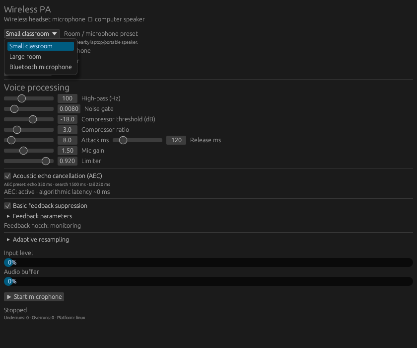
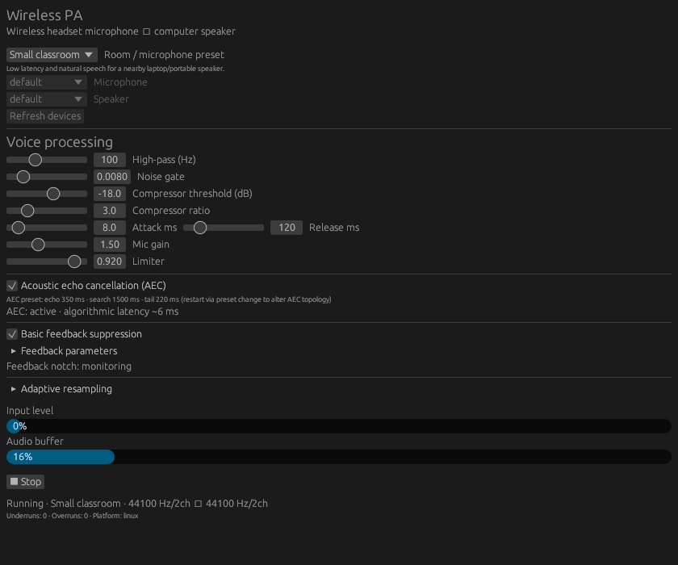
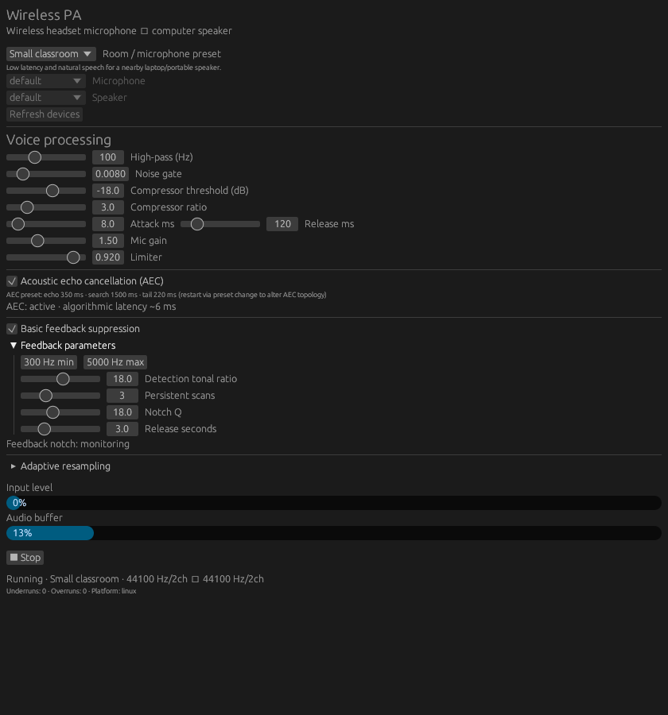
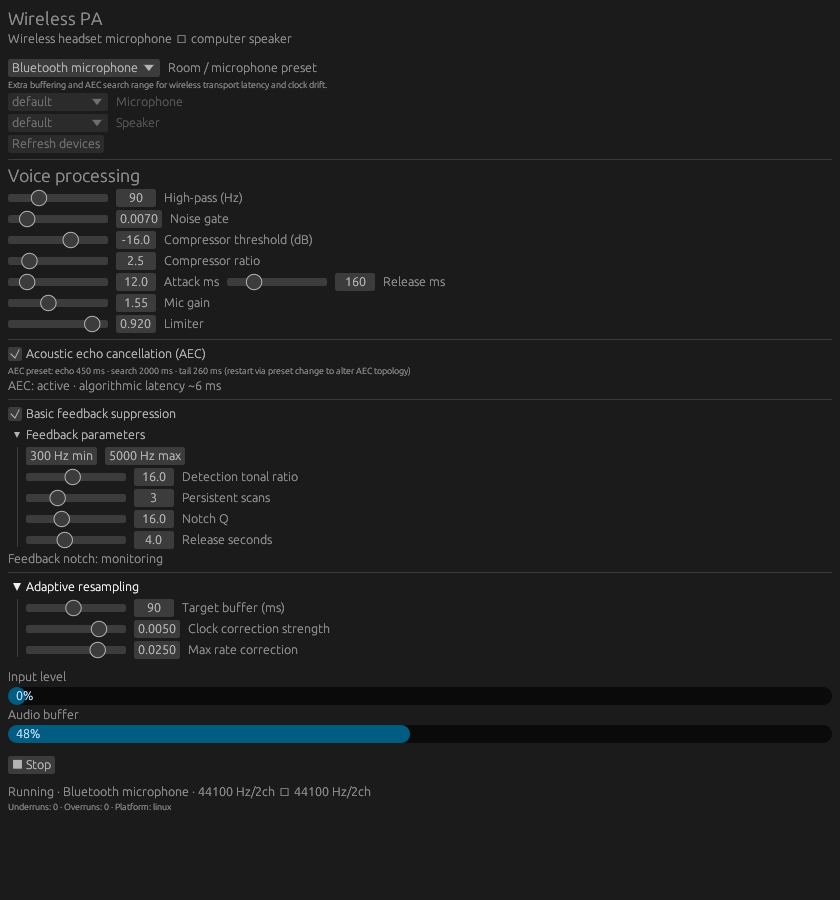
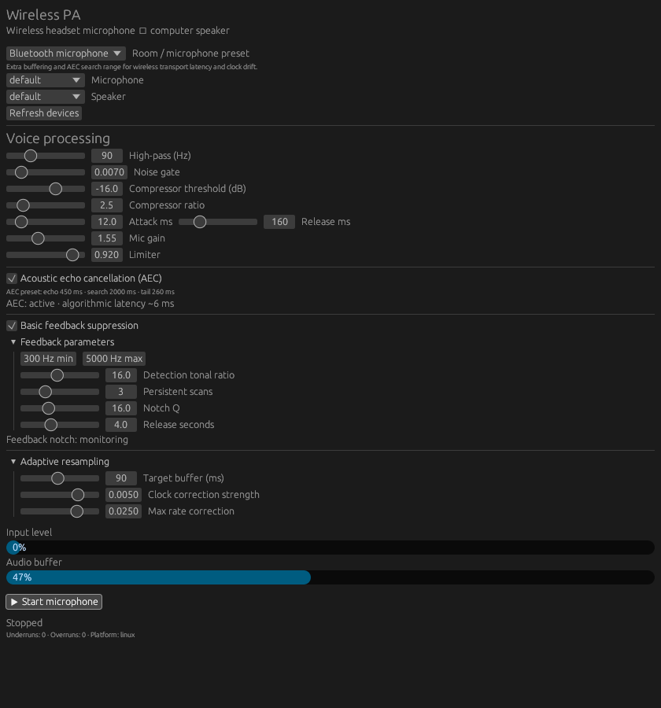

# Wireless PA: configuration and usage guide

Wireless PA sends a microphone connected to your computer to a speaker connected
to that computer. It processes speech, reduces noise, and helps control echo and
feedback. Pair Bluetooth devices or connect a wireless USB receiver in your
operating system first; the app does not pair devices or stream audio over Wi-Fi.

## 1. Download and open

Get an archive from the [Releases page](https://github.com/tien226anh/wireless-voice-class/releases).

| System | Archive | Open after extracting |
| --- | --- | --- |
| Windows x64 | `wireless-pa-windows-x64.zip` | Double-click `wireless-pa.exe`. |
| Linux x64 | `wireless-pa-linux-x64.tar.gz` | Run `./wireless-pa` in the extracted folder. |

Linux needs a graphical desktop and the ALSA runtime. If no release has been
published yet, follow the [source build instructions](../README.md#build).

Connect your microphone and speaker, confirm they work in your system's sound
settings, and allow microphone access when your operating system requests it.
Start with a low speaker volume and place the speaker away from the microphone.

## 2. Choose your microphone, speaker, and preset

1. Choose a **Room / microphone preset** from the table below.
2. Select the intended **Microphone** and **Speaker**.
3. If you connected a device after opening the app, click **Refresh devices**.
4. Keep **Acoustic echo cancellation (AEC)** and **Basic feedback suppression**
   checked as a starting point.
5. Click **Start microphone** and speak at your normal distance from the mic.

On Linux, `default`, `pulse`, or `pipewire` can refer to system audio routing.
If you use one of these entries, choose the actual headset and speaker in your
system's sound settings. Stop the app before changing devices, refresh, and start
again. The device selectors and refresh button are disabled during playback.

These are unedited captures of the Linux app using isolated, silent virtual audio
devices. Both selectors therefore show `default`; your device names will differ.
They demonstrate the interface and stream lifecycle, not real-room sound quality.

| Preset | Intended use | Buffer target | Initial mic gain |
| --- | --- | --- | --- |
| Small classroom | Nearby laptop or portable speaker; the default starting point | 45 ms | 1.50 |
| Large room | More compression and stronger feedback detection | 65 ms | 1.65 |
| Bluetooth microphone | More buffering for wireless delay and differing device clocks | 90 ms | 1.55 |

Choose a preset **before** fine-tuning. Selecting a different preset replaces your
manual settings. If audio is running, the app stops and restarts it automatically
to apply that preset's echo-canceller configuration; expect a brief interruption.
There is no Save button or persistent configuration: reopening the app restores
the Small classroom defaults. Keep a note of any settings you want to reuse.

## 3. Start, check the meters, and stop

The bottom status must say **Running**. It shows the preset plus input and output
sample rates and channel counts. **Stop** ends microphone routing. Use Stop before
unplugging a device or changing system audio routing.

| Indicator | Meaning and what to do |
| --- | --- |
| Input level | The signal **after** echo cancellation and voice processing. Speak and check that it moves. A closed noise gate, zero gain, or silence can keep it at zero even when capture is working. |
| Audio buffer | The fraction of the internal queue currently occupied. It is not a volume meter or the percentage of the target delay. It does not need to reach 100%. |
| AEC algorithmic latency | Delay introduced by the echo canceller only. Device, wireless, and buffering delays add to the total you hear. |
| Feedback notch: monitoring | Suppression is enabled and currently has no active notch. |
| Feedback notch active | A narrow band of frequencies is being reduced; the displayed frequency is the detected tone. |
| Underruns / Overruns | Internal queue counters. Watch whether they keep increasing while audio breaks up; they reset on Start. Zero does not prove a perfect wireless link. |

The screenshots use silence, so the input meter stays at 0% even while the stream
is running. In normal use, increase speaker volume gradually after confirming
that normal speech passes through clearly.

## 4. Tune voice processing

Change one control at a time while speaking. These sliders and the AEC/feedback
checkboxes update during playback.

| Control | How to use it |
| --- | --- |
| High-pass (Hz) | Reduces low rumble. Raise it if handling noise or bass is excessive; lower it if the voice becomes thin. Presets start at 90–120 Hz. |
| Noise gate | Mutes very quiet audio. Raise it slightly to reduce background noise; lower it if quiet words or word endings disappear. `0` disables the threshold. |
| Compressor threshold (dB) | The level above which louder speech is reduced. A more negative value compresses more of the signal. |
| Compressor ratio | Controls how strongly loud speech is reduced. `1` provides no compression; higher values even out loud and quiet phrases more strongly. |
| Attack ms / Release ms | How quickly compression starts and relaxes. Begin with the preset values; increase release if the level audibly pumps. |
| Mic gain | Output gain applied to processed speech. `1` is unity and `0` is silent. Raise gradually if speech is too quiet. |
| Limiter | Caps the processed signal's peak amplitude. Keep the preset's 0.90–0.92 initially. Lowering it limits peaks; it cannot repair clipping that already happened in the microphone. |

If speech is distorted, reduce the microphone input level in the operating system
first, then check app gain and speaker volume. If the output is quiet but the meter
moves, check the selected output and system mixer before increasing gain further.

## 5. Echo and feedback

**AEC** uses the app's speaker output as a reference to reduce that sound when it
returns through the microphone. The preset controls its delay search and echo
tail. The checkbox bypasses processing; the preset selector changes the topology.
The app does not use unrelated music or other applications' audio as its reference.

Open **Feedback parameters** for these controls:

| Control | Effect |
| --- | --- |
| Hz min / Hz max | Limits the frequency range searched for ringing. Keep min below max. |
| Detection tonal ratio | Lower values detect tones more readily, with more chance of affecting wanted audio. |
| Persistent scans | Lower values react sooner; higher values require a tone to persist longer. |
| Notch Q | Higher values make a narrower cut around the detected frequency. |
| Release seconds | How long the suppression remains after detecting a tone. |

If you hear a squeal, click **Stop** or lower speaker volume, then increase the
distance between speaker and microphone. Resume at lower gain. These controls
help suppress feedback; speaker placement and volume still matter.

## 6. Bluetooth delay and audio dropouts

Start with **Bluetooth microphone**, then open **Adaptive resampling**:

| Control | Effect |
| --- | --- |
| Target buffer (ms) | A higher target provides more audio in reserve but increases delay. Raise it in small steps if audio breaks up; lower it gradually if playback is stable and delay is too high. |
| Clock correction strength | Controls how strongly the app responds to changes in queue fill. Keep the preset value initially. |
| Max rate correction | Limits the resampling adjustment. `0.025` means 2.5%, not 0.025%. Keep the preset value unless you are investigating clock drift. |

The target buffer is only part of total latency. A lower setting cannot remove
delay already introduced by Bluetooth or the audio device. For persistent delay,
compare with a wired or USB device and check the wireless connection separately.

## 7. Troubleshooting

| Symptom | Check |
| --- | --- |
| No microphone / No speaker | Confirm the device is connected and visible to the OS; Stop, Refresh devices, and select it again. |
| `Failed: …` after Start | Read the complete status message. Check device availability, microphone permissions, and system audio settings. |
| Capture-rate error | Choose a supported microphone rate in system/device settings, usually 44.1 or 48 kHz, then refresh and restart. The app validates an 8–48 kHz input range at startup even when AEC is unchecked. |
| Running, but no audible voice | Confirm the correct input/output, system volume and mute states, nonzero Mic gain, and a Noise gate low enough to pass speech. |
| Quiet speech cuts out | Lower Noise gate and check the OS microphone input level. |
| Ringing or squealing | Stop, reduce speaker volume/gain, and move the speaker away from the microphone. |
| Crackles or pauses | Watch the queue counters, try a larger Target buffer, check the wireless connection, and compare with another device. |
| Device disconnected during playback | Stop, reconnect, Refresh devices, reselect, and Start. The app does not automatically reconnect streams. |
| Start/Stop or the status is below the window | Enlarge the window or collapse Feedback parameters and Adaptive resampling. |
| Custom values changed unexpectedly | A different preset resets its controls; reopening the app also restores defaults. |

For maintainers, [capture instructions](CAPTURE.md) explain how to regenerate these
screenshots by running the actual application.
