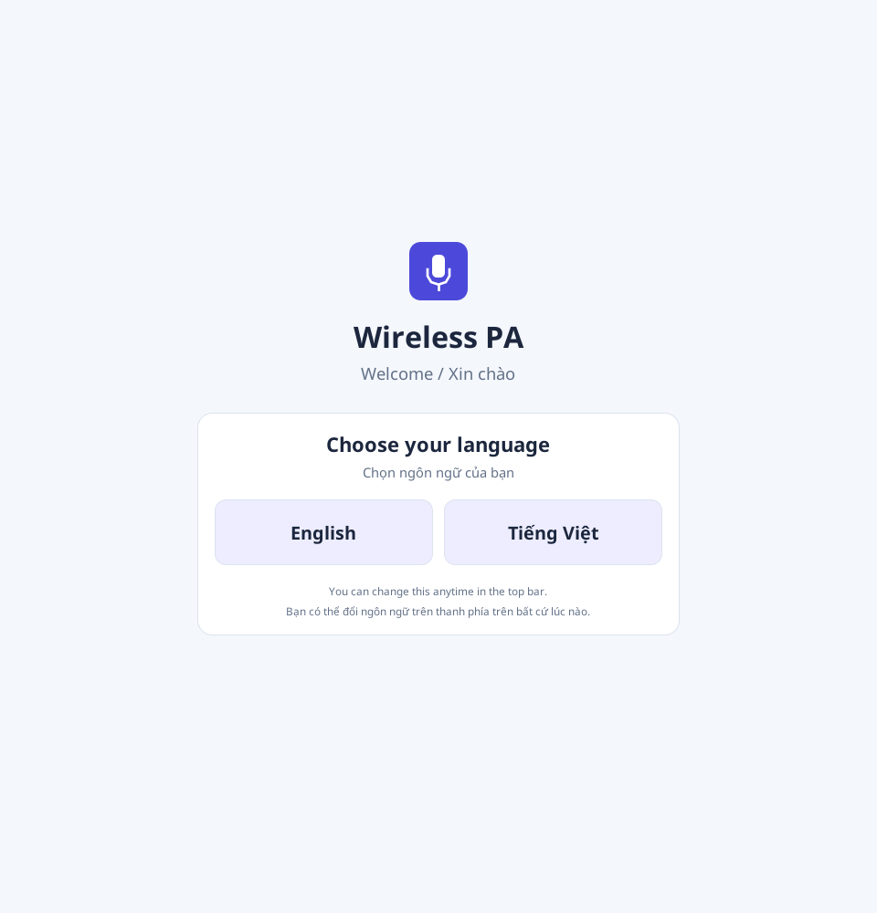
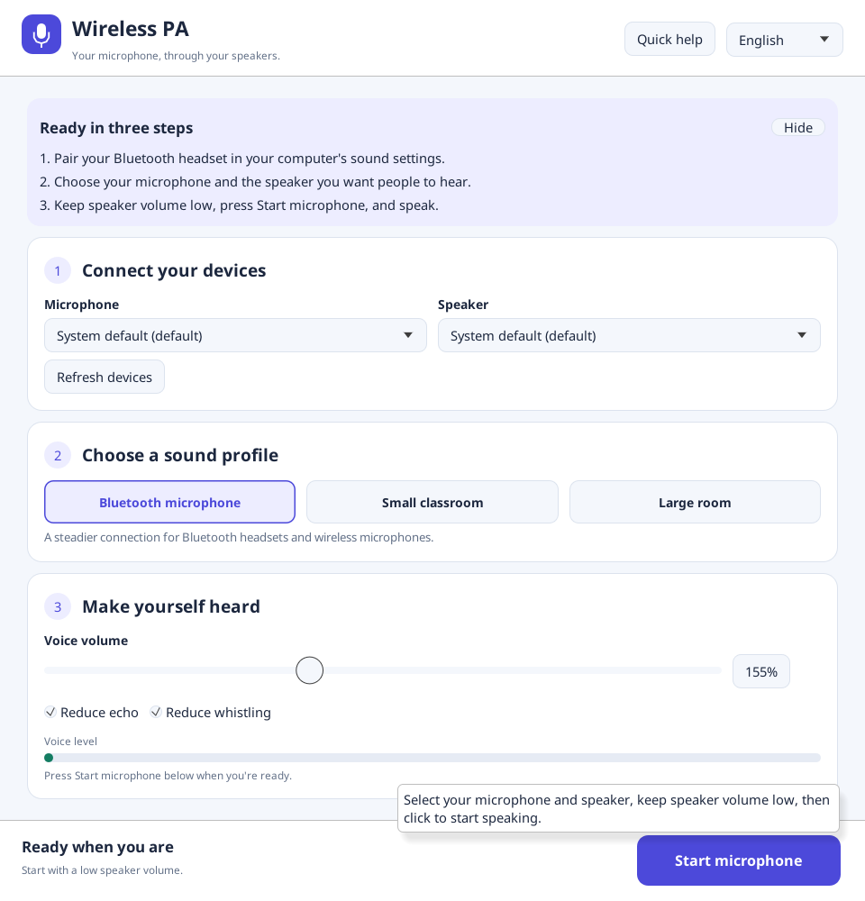

# Wireless PA user guide

[Tiếng Việt](USER_GUIDE_VI.md)

Wireless PA plays a microphone connected to your computer through a speaker.
Pair your Bluetooth headset or connect a wireless USB receiver in your operating
system first. The app uses devices already available to the computer.

## Open the app and choose a language

Download a version from the [Releases page](https://github.com/tien226anh/wireless-voice-class/releases)
and extract its archive.

| System | Archive | Open |
| --- | --- | --- |
| Windows x64 | `wireless-pa-vX.Y.Z-windows-x64.zip` | Double-click `wireless-pa.exe`. |
| Linux x64 | `wireless-pa-vX.Y.Z-linux-x64.tar.gz` | Run `./wireless-pa` in a graphical desktop with ALSA. |

On first launch, choose **English** or **Tiếng Việt**. The app remembers your
choice. You can change language at any time using the selector in the top bar,
including while audio is running. Changing language does not reset sound controls.

If no release is available, use the [source build instructions](../README.md#build).

## Start in three steps

1. **Connect your devices.** Choose the microphone you will speak into and the
   speaker your audience should hear. Click **Refresh devices** after connecting
   or pairing a device.
2. **Choose a sound profile.** **Bluetooth microphone** is selected by default.
   The presets set the technical controls for you.
3. **Make yourself heard.** Keep speaker volume low, click **Start microphone** in
   the bottom bar, and speak. Gradually adjust **Voice volume** if needed.

The bottom bar stays visible when you scroll or resize the window. Click
**Stop microphone** before changing devices or unplugging a headset.

**Quick help** shows or hides the three-step instructions. Hover over Start,
device selectors, profiles, and sound controls for short explanations. These
tooltips follow the selected language.

If a selector shows **System default**, choose the actual device in your
computer's sound settings. Device selectors are disabled while audio is running;
stop playback to change them.

## Choose a profile

| Profile | Use it for | Initial audio reserve |
| --- | --- | --- |
| Bluetooth microphone — default | Bluetooth headsets and wireless microphone connections | 90 ms |
| Small classroom | A nearby laptop or portable speaker | 45 ms |
| Large room | More even speech volume and stronger feedback control in a larger space | 65 ms |

Choose a profile before adjusting sound controls. Switching profiles replaces
manual sound adjustments and briefly restarts audio if it is running. Reopening
the app restores the Bluetooth profile and sound defaults; **language is saved**.

## Adjust your voice and check playback

| Control | What to do |
| --- | --- |
| Voice volume | Raise gradually if speech is too quiet. 100% is unity gain after processing; 0% is silent. Bluetooth starts at 155%. |
| Reduce echo | Leave enabled initially. It helps reduce the app's speaker sound when the microphone picks it up again. |
| Reduce whistling | Leave enabled initially. It helps suppress persistent ringing tones. |
| Voice level | Watch it move while speaking. It measures the signal after processing, not the raw microphone input. |
| You're live | Confirms that the app opened its audio streams. It does not guarantee that the correct physical speaker is selected. |

The guide captures use a silent virtual microphone and speaker, so the level
stays at zero. They demonstrate the real interface and stream lifecycle; they do
not measure real-room audio quality. Your device names may differ.

## Advanced sound settings

Most users can leave this section closed. Open it only to solve a specific sound
problem; every control also has a translated tooltip.

| Section | Controls and purpose |
| --- | --- |
| Voice clarity | Remove low rumble filters bass/handling noise. Background noise threshold mutes quiet sounds; lower it if quiet words disappear. Compression evens out loud phrases. Peak volume limit caps peaks. |
| Feedback fine-tuning | Choose the frequency range, detection threshold, number of confirmations, filter focus, and how long suppression remains. Lower detection thresholds react more readily but may affect wanted sounds. |
| Wireless stability & delay | Increase Audio reserve if sound breaks up. Higher values add delay. Leave clock correction controls at their preset values initially. |
| Technical details | Shows device rates, channel counts, echo-canceller latency, buffer occupancy, queue counters, and the original device error when startup fails. |

The audio reserve is only part of total latency. Lowering it cannot remove delay
already introduced by a Bluetooth device. A value such as 0.025 for maximum rate
correction means 2.5%.

If ringing starts, stop playback or lower speaker volume, move the speaker away
from the microphone, and resume at lower volume. Software suppression does not
replace sensible speaker placement.

## Troubleshooting

| Problem | Try this |
| --- | --- |
| No microphone or speaker found | Check pairing/cables and OS sound settings, then Refresh devices. Start stays disabled until both device lists are available. |
| Couldn't start audio | Check the selected devices and microphone permissions. Open Advanced sound settings → Technical details for the original error. |
| Capture-rate error | Set the microphone to 44.1 or 48 kHz in system/device settings, then refresh and restart. The app validates an 8–48 kHz capture range even when Reduce echo is off. |
| You're live, but no sound | Check the physical input/output, system mute/volume, nonzero Voice volume, and the background noise threshold. |
| Quiet words are cut off | Lower Background noise threshold under Voice clarity. |
| Sound crackles or pauses | Increase Audio reserve a little, check the wireless connection, and compare with a wired/USB device. |
| Device disconnects | Stop, reconnect, Refresh devices, select again, and Start. Streams do not reconnect automatically. |
| Controls do not fit on screen | Scroll the content area or collapse advanced sections. Start/Stop stays in the bottom bar. |
| Want another language | Use English / Tiếng Việt in the top bar. The new choice is saved immediately. |

For maintainers, see [capture instructions](CAPTURE.md). Noto Sans is bundled for
Vietnamese text; its [font license](FONT_LICENSE.txt) is included with releases.
