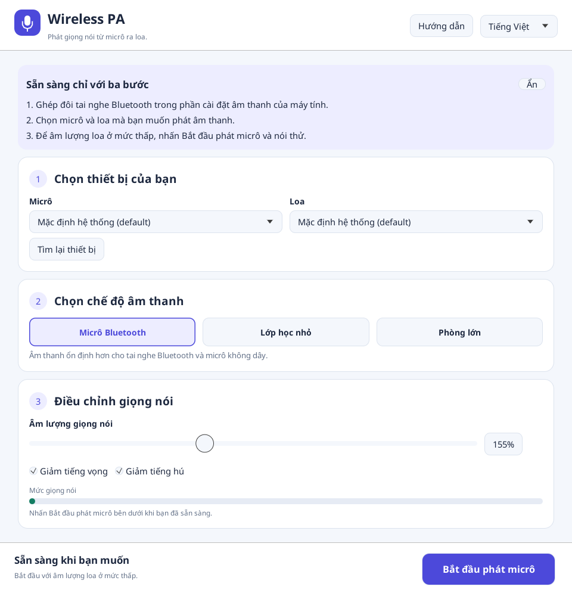

# Hướng dẫn sử dụng Wireless PA

[English](USER_GUIDE.md)

Wireless PA phát giọng nói từ micrô kết nối với máy tính ra loa. Trước tiên, hãy
ghép đôi tai nghe Bluetooth hoặc cắm bộ thu USB không dây trong hệ điều hành.
Ứng dụng sử dụng những thiết bị mà máy tính đã nhận; không tự ghép đôi Bluetooth.

## Mở ứng dụng và chọn ngôn ngữ

Tải bản phù hợp từ [trang Releases](https://github.com/tien226anh/wireless-voice-class/releases),
giải nén, rồi mở ứng dụng.

| Hệ điều hành | Tệp tải về | Cách mở |
| --- | --- | --- |
| Windows x64 | `wireless-pa-vX.Y.Z-windows-x64.zip` | Nhấp đúp `wireless-pa.exe`. |
| Linux x64 | `wireless-pa-vX.Y.Z-linux-x64.tar.gz` | Chạy `./wireless-pa` trong môi trường đồ họa có ALSA. |

Lần đầu mở, chọn **English** hoặc **Tiếng Việt**. Ứng dụng ghi nhớ lựa chọn này.
Bạn có thể đổi ngôn ngữ trên thanh phía trên bất cứ lúc nào, kể cả khi đang phát.
Đổi ngôn ngữ không làm thay đổi thiết lập âm thanh.

## Bắt đầu với ba bước

1. **Chọn thiết bị của bạn.** Chọn micrô dùng để nói và loa dùng để phát cho người
   nghe. Nhấn **Tìm lại thiết bị** sau khi kết nối hoặc ghép đôi thiết bị mới.
2. **Chọn chế độ âm thanh.** **Micrô Bluetooth** được chọn mặc định. Chế độ này
   chuẩn bị sẵn các thiết lập kỹ thuật để bạn không phải chỉnh từng thông số.
3. **Điều chỉnh giọng nói.** Để âm lượng loa ở mức thấp, nhấn **Bắt đầu phát micrô**
   ở thanh dưới cùng, rồi nói thử. Tăng **Âm lượng giọng nói** từ từ nếu cần.

Thanh bắt đầu/dừng luôn hiển thị khi cuộn nội dung hoặc thu nhỏ cửa sổ. Nhấn
**Dừng phát micrô** trước khi đổi thiết bị hoặc rút tai nghe.

Nút **Hướng dẫn** hiện hoặc ẩn ba bước hướng dẫn. Rê chuột lên nút bắt đầu, ô
chọn thiết bị, chế độ hoặc thanh điều chỉnh để xem giải thích bằng ngôn ngữ
đang chọn.

Nếu ô chọn ghi **Mặc định hệ thống**, hãy chọn thiết bị thật trong cài đặt âm
thanh của máy tính. Không thể đổi thiết bị khi đang phát; hãy dừng trước.

## Chọn chế độ phù hợp

| Chế độ | Khi nên dùng | Bộ đệm ban đầu |
| --- | --- | --- |
| Micrô Bluetooth — mặc định | Tai nghe Bluetooth hoặc micrô không dây | 90 ms |
| Lớp học nhỏ | Loa máy tính hoặc loa di động đặt gần | 45 ms |
| Phòng lớn | Cần âm lượng đều hơn và chống hú mạnh hơn trong không gian rộng | 65 ms |

Chọn chế độ trước khi tinh chỉnh. Đổi chế độ sẽ đặt lại các thông số âm thanh
và khởi động lại luồng âm thanh trong giây lát nếu đang phát. Khi mở lại ứng dụng,
chế độ và âm thanh trở về mặc định Bluetooth; **ngôn ngữ vẫn được ghi nhớ**.

## Điều chỉnh và kiểm tra âm thanh

| Mục | Cách dùng |
| --- | --- |
| Âm lượng giọng nói | Tăng từ từ nếu còn nhỏ. 100% giữ nguyên mức âm lượng sau xử lý; 0% là tắt tiếng. Chế độ Bluetooth bắt đầu ở 155%. |
| Giảm tiếng vọng | Nên bật lúc đầu. Giúp giảm âm thanh từ loa của ứng dụng bị micrô thu lại. |
| Giảm tiếng hú | Nên bật lúc đầu. Giúp giảm tiếng rít kéo dài. |
| Mức giọng nói | Quan sát thanh thay đổi khi nói. Đây là tín hiệu sau xử lý, không phải tín hiệu micrô thô. |
| Đang phát giọng nói | Cho biết ứng dụng đã mở luồng âm thanh. Vẫn cần kiểm tra xem đã chọn đúng loa thật hay chưa. |

Ảnh minh họa được chụp từ ứng dụng thật với micrô và loa ảo không có tiếng, nên
thanh mức giọng nói ở 0. Ảnh giúp hiểu cách dùng giao diện; không thể hiện chất
lượng âm thanh trong phòng thực tế. Tên thiết bị trên máy bạn có thể khác.

## Thiết lập âm thanh nâng cao

Bạn có thể để mục này đóng nếu âm thanh đã phù hợp. Chỉ mở khi cần xử lý một vấn
đề cụ thể; từng thông số đều có chú giải khi rê chuột.

| Nhóm | Công dụng |
| --- | --- |
| Độ rõ của giọng nói | Lọc tiếng ù trầm, đặt ngưỡng tiếng ồn nền, nén để làm đều âm lượng và giới hạn âm thanh quá lớn. Nếu mất những từ nói nhỏ, giảm ngưỡng lọc tiếng ồn nền. |
| Tinh chỉnh chống hú | Chọn dải tần kiểm tra, ngưỡng nhận diện, số lần xác nhận, độ hẹp bộ lọc và thời gian giữ chống hú. Ngưỡng thấp nhận diện nhanh hơn nhưng có thể ảnh hưởng âm thanh cần giữ. |
| Độ ổn định và độ trễ không dây | Tăng Bộ đệm âm thanh nếu bị ngắt quãng. Bộ đệm lớn hơn cũng làm tăng độ trễ. Nên giữ các thông số đồng hồ âm thanh theo chế độ mặc định. |
| Thông tin kỹ thuật | Hiển thị tần số lấy mẫu, số kênh, độ trễ khử tiếng vọng, mức sử dụng bộ đệm, bộ đếm và lỗi gốc của thiết bị khi không thể bắt đầu. |

Bộ đệm chỉ là một phần của độ trễ tổng. Giảm bộ đệm không loại bỏ được độ trễ do
thiết bị Bluetooth gây ra. Mức điều chỉnh tốc độ 0,025 tương đương 2,5%.

Nếu có tiếng hú, hãy dừng hoặc giảm âm lượng loa, đặt loa xa micrô hơn rồi thử
lại ở mức nhỏ. Chức năng chống hú không thay thế việc bố trí loa hợp lý.

## Xử lý sự cố

| Vấn đề | Cách kiểm tra |
| --- | --- |
| Chưa tìm thấy micrô hoặc loa | Kiểm tra dây, ghép đôi và cài đặt âm thanh hệ thống; nhấn Tìm lại thiết bị. Nút bắt đầu chỉ dùng được khi có cả micrô và loa. |
| Chưa thể phát âm thanh | Kiểm tra thiết bị và quyền truy cập micrô. Xem Thiết lập âm thanh nâng cao → Thông tin kỹ thuật để đọc lỗi gốc. |
| Lỗi tần số lấy mẫu | Chọn 44,1 hoặc 48 kHz trong cài đặt micrô của hệ thống, rồi tìm lại và khởi động lại. Ứng dụng kiểm tra dải 8–48 kHz kể cả khi tắt Giảm tiếng vọng. |
| Đang phát nhưng không nghe thấy | Kiểm tra đúng micrô/loa, trạng thái tắt tiếng, âm lượng hệ thống, Âm lượng giọng nói lớn hơn 0 và ngưỡng tiếng ồn nền. |
| Mất những từ nói nhỏ | Giảm Ngưỡng lọc tiếng ồn nền trong Độ rõ của giọng nói. |
| Âm thanh ngắt quãng | Tăng bộ đệm một chút, kiểm tra kết nối không dây và thử thiết bị có dây hoặc USB để so sánh. |
| Thiết bị bị ngắt kết nối | Dừng, kết nối lại, Tìm lại thiết bị, chọn lại rồi bắt đầu. Ứng dụng không tự nối lại luồng âm thanh. |
| Không thấy hết thông số | Cuộn nội dung hoặc đóng các mục nâng cao. Nút bắt đầu/dừng luôn ở thanh dưới cùng. |
| Muốn đổi ngôn ngữ | Chọn English / Tiếng Việt trên thanh phía trên. Lựa chọn mới được lưu ngay. |

Noto Sans được tích hợp để hiển thị đầy đủ dấu tiếng Việt. Xem
[giấy phép phông chữ](FONT_LICENSE.txt).
